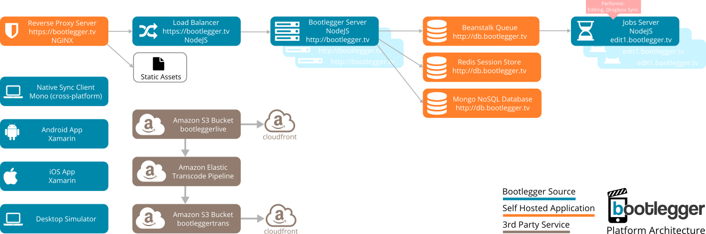

# BootleggerServer
Bootlegger is a system to orchestrate multiple users capturing footage for a film shoot either. Multiple direction and commissioning engines are available including real-time shot allocation and individual user feedback on shot quality and their performance. 

Each user's native mobile application connects to a Bootlegger server, which coordinates their actions according to a pre-defined shoot templates.

## Vagrant Deployment (preferred)
We have provided a Vagrant provision script to deploy a fully working bootlegger development environment.

1. Download Vagrant from [https://www.vagrantup.com/downloads.html]
2. Run `vagrant up`
2. [OPTIONAL] Generate Amazon S3 and CloudFront credentials, and if required, Elastic Beanstalk profiles.
3. Generate Google or Facebook OAuth credentials for your app, using http://localhost:1337 as the redirect URL.
4. Once the server has provisioned, edit `config/local.js` with your details, particularly `admin_emails` and either Google or Facebook OAuth credentials.

Visiting http://localhost:1337 will present a running instance of the server.

After editing files too restart the serverr:

Run `vagrant ssh`

`$ pm2 restart app`

If modules are not present, or you have trouble starting the server, running `vagrant provision` usually fixes most things.

*Local files are located in /vagrant*

*node_module directory is hardlinked to and internal VM directory to avoid symlink issues on npm install*

## Local Deployment (for production or non-vagrant)
Bootlegger requires:

- Node.js https://nodejs.org/
- MongoDB https://www.mongodb.org/
- Redis http://redis.io/
- Google Developer Account (optional)
- Facebook Developer Account (optional)
- Dropbox Developer Account (optional)
- Beanstalk http://kr.github.io/beanstalkd/
- Amazon S3 Account
- Amazon Elastic Transcoder Account

### Setting Up Development
- Install all services
> You might find installing [Ampps](http://www.ampps.com/downloads) helps with mongo, as it includes rockmongo, an admin ui for mongodb.

- Clone from Git
- Enter server directory
- Run `npm install`
- Copy config/local.example.js to config/local.js and fill in missing information, including your Mongo and Redis, Google and S3 connection details.

### Production Deployment

We advise using `pm2` or similar keep your server running.

To start in production mode (which minifiys and concats all resources), use the `--prod` switch when starting pm2 e.g. `pm2 start app.js -- --prod`

In production mode, you will need to run a reverse proxy in front of the Bootlegger server to serve static assets. An example nginx config file is provided in the repo for this purpose.  

### Starting the Server
Running bootlegger on your local machine:
`node app.js`

Running a 'live' server:
`node app.js --prod`

Pointing your browser at `http://localhost` will give you the website.

When using sails, you will have to close and restart the server after any changes to controller files `CTL+C`. Edits to view files should not require a restart.

## Development
Bootlegger is built on the SailsJS (http://sailsjs.org/) MVC engine, which is based on expressjs.

View files are located in `views\<controller>\<view>.ejs`

Controller logic is located in `api\controllers\<controller>.js`